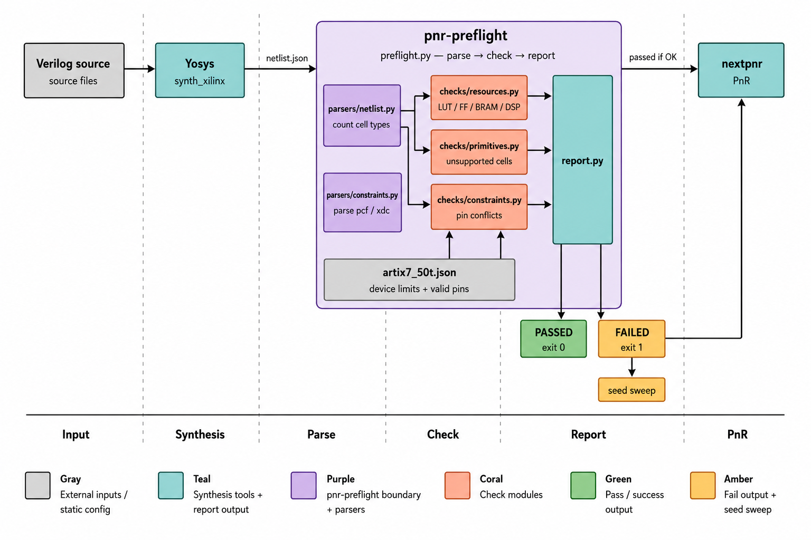

# Project Overview

`pnr-preflight` is a Python command-line tool that performs fast, static checks on a Yosys JSON netlist before running place-and-route with `nextpnr-xilinx`. It is intended to catch common, high-cost failures (resource overuse, unsupported primitives, and pin conflicts) early — in seconds — so you don't waste time running a long PnR job that will fail.

## Why It Exists

On small FPGA projects, `nextpnr-xilinx` can fail late, fail vaguely, or spend a long time exploring placements before the design is clearly impossible. `pnr-preflight` moves the useful checks earlier so you can see the likely failure mode in seconds instead of re-running full PnR blindly.

This project was developed for the Numato Mimas A7 / XC7A50T flow and validated against real Yosys output from the workspace.

## Features / What It Checks

- Resource utilization: LUTs, FFs, BRAM, DSP, IO against device limits
- Unsupported or risky Xilinx primitives (e.g., `MMCME2_ADV`) that `nextpnr-xilinx` struggles to place
- Pin constraint validation for `.xdc` / `.pcf` files (invalid pins, duplicates)
- Optional seed-sweep runner to retry PnR with multiple seeds (`runner/seed_sweep.py`)

## Architecture



## Project Structure

- `preflight.py` — CLI entrypoint
- `parsers/netlist.py` — load Yosys JSON netlist and count cells
- `parsers/constraints.py` — parse `.pcf` and `.xdc` constraints
- `checks/resources.py` — aggregate resource counts and compare with device JSON
- `checks/primitives.py` — flag unsupported primitives
- `checks/constraints.py` — validate pin assignments
- `runner/seed_sweep.py` — optional nextpnr seed sweeps
- `devices/` — device JSON files (e.g., `artix7_50t.json`)
- `examples/` — example XDC and negative test (`not_for_pnr_mmcm.v`)
- `tests/` — basic smoke tests
- `report.py` — terminal report formatting
- `README.md`, `LICENSE`

## Requirements

- Python 3.8+
- `yosys` (for synthesis to JSON)
- Optional: `nextpnr-xilinx` (for seed sweeps / final PnR)

## Installation

Clone the repository and create a Python virtual environment:

```bash
git clone https://github.com/Pratham-Bit-Flip/pnr-preflight.git
cd pnr-preflight
python -m venv .venv
source .venv/bin/activate
# If a requirements file is added later: pip install -r requirements.txt
```

## Quick Start

Generate a Yosys JSON netlist and run `pnr-preflight`:

```bash
yosys -p "read_verilog ../LED_BLINK/top.v ../LED_BLINK/led_blink.v; synth_xilinx -flatten -top top; write_json netlist.json"
python preflight.py --netlist netlist.json --top top --device devices/artix7_50t.json --xdc ../boards/xillinx/numato_io.xdc
```

Enable verbose mode to list cell counts:

```bash
python preflight.py --netlist netlist.json --top top --device devices/artix7_50t.json --xdc ../boards/xillinx/numato_io.xdc --verbose
```

## Example Output

```text
========================================================================
PREFLIGHT REPORT
========================================================================
------------------------------------------------------------------------
NETLIST CELLS
------------------------------------------------------------------------
BUFG                 1
CARRY4               7
FDCE                 27
IBUF                 2
INV                  28
LUT4                 1
LUT5                 27
LUT6                 3
MUXF7                4
MUXF8                2
OBUF                 1
------------------------------------------------------------------------
RESOURCE UTILIZATION
------------------------------------------------------------------------
[OK] LUT   31/32600 0.1% [....................]
[OK] FF    27/65200 0.0% [....................]
[OK] BRAM  0/75 0.0% [....................]
[OK] DSP   0/120 0.0% [....................]
[OK] IO    3/250 1.2% [....................]
------------------------------------------------------------------------
PRIMITIVE COMPATIBILITY
------------------------------------------------------------------------
OK
------------------------------------------------------------------------
CONSTRAINT VALIDATION
------------------------------------------------------------------------
OK
PREFLIGHT PASSED — safe to run PnR
```

## Validation

The tool was verified on a real workspace design, the LED blink example in `LED_BLINK/`, using the board constraints from `boards/xillinx/numato_io.xdc`. The negative example `examples/not_for_pnr_mmcm.v` was used to verify the primitive checker.

## Comparison with nextpnr

`pnr-preflight` is a static pre-checker that runs in seconds on a Yosys JSON netlist. It is not a replacement for nextpnr; instead, it identifies likely failure causes before you run PnR. Examples:

- nextpnr: may hang, crash, or print a cryptic "placement failed" after a long run
- pnr-preflight: reports actionable issues like "94% LUT utilization (above the 80% warning threshold)" or "FAIL MMCME2_ADV: MMCM is not reliably placed by nextpnr-xilinx"

Use `pnr-preflight` to reduce wasted PnR runtime and get clearer guidance on design fixes.

## Notes

- The device database in `devices/artix7_50t.json` targets the Numato Mimas A7 / XC7A50T.
- `examples/mimas_a7_minimal.xdc` is a board-specific constraint example.
- `tests/smoke_test.py` is a basic repository smoke check.

## Project Status

Exploration / early-prototype. AI-assisted drafting was used for initial drafts; each check and test was reviewed and validated by the maintainer.

